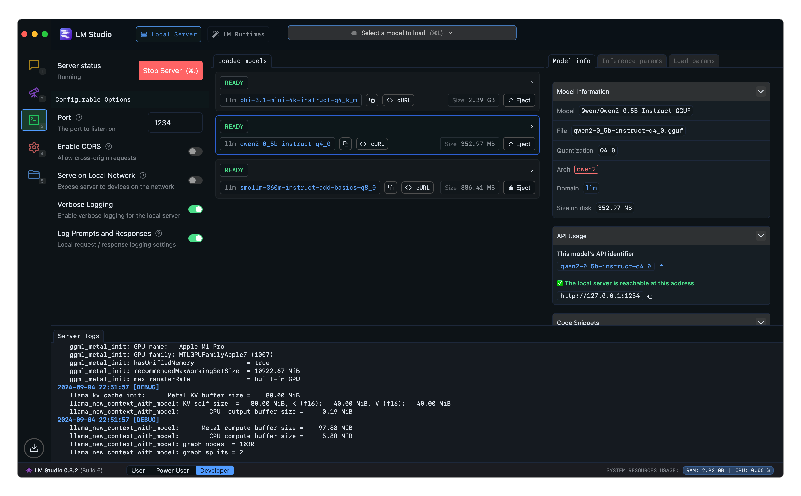

# Bachelor End Project 
## Interaction with Artificial Social Agents - A thematic analysis of people's experiences

| File                                                  | Description                                                                               |
|-------------------------------------------------------|-------------------------------------------------------------------------------------------|
| `bep.ipynb`                                           | Notebook containing the code and quantitative analysis of the manual thematic analysis    | 
| `bep-llm.ipynb`                                       | Notebook presenting the code of the LLM-based thematic analysis                           |
| `data/data.ods`                                       | The **entire** conducted Manual Thematic Analysis including the process and peer analysis |
| `data/data_ASAQ_666pps_10ASAs_8EQs.xlsx`              | The **unchanged** ASAQ dataset                                                            |
| `data/inter_coder_agreement_peer.xlsx`                | The **unchanged** first Inter-Coder Agreement, presented as-is by the peer                |
| `data/inter_coder_agreement_2_asaq_mapping_peer.xlsx` | The **unchanged** second Inter-Coder Agreement, presented as-is by the peer               |
| `data/llm/`                                           | The outputs files of the LLM: `<llm>-response#(-run#)`                                    |
| `data/llm/...response1`                               | The unguided prompts (i.e. "Given the text, give me the themes")                          |
| `data/llm/...response2`                               | The guided prompts (i.e. "Given the themes, can the LLM find them in the responses.")     |
| `data/llm/metadata.json`                              | Cohen's Kappa of every LLM                                                                |

## Note
For the LLM part [LMStudio](https://lmstudio.ai/) was used, specifically `lmstudio-python`. You'll need to download it, download the local LLMs, and run it as a server (see image below). Afterwards, you can run the code and switch the model to the next one in the list when prompted by the `input`.

## License
[**MIT**](https://www.github.com/ckarakoc/bep-asa/blob/master/LICENSE)